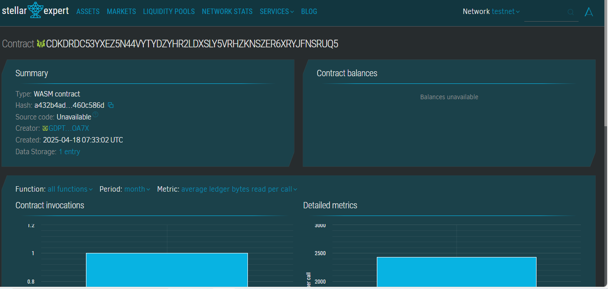

# Client Review System

## 📌 Project Title
Client Review System

## 🧾 Project Description
This decentralized application allows users to provide reviews and ratings for different clients in a transparent and tamper-proof manner using Soroban smart contracts. Each review includes the reviewer's name, comment, and a rating between 1 to 5.

## 🌟 Project Vision
To create a decentralized, immutable, and publicly verifiable client feedback system that encourages transparency and trust in service-based ecosystems.

## 🔑 Key Features
- **Add Review**: Submit a review for a client with a rating and comment.
- **View Reviews**: Fetch all reviews associated with a specific client.
- **Average Rating**: Calculate and return the average rating of a client.
- **Secure Storage**: Reviews are stored immutably on the Soroban-based ledger.

## 🔭 Future Scope
- **Client Identity Verification**: Link reviews to verified client profiles.
- **Upvoting Reviews**: Let users upvote helpful reviews.
- **Spam Detection**: Integrate mechanisms to flag or reduce spam or fake reviews.
- **Analytics Dashboard**: Visual insights into reviews and rating trends over time.
- **Cross-chain Syncing**: Integrate with other blockchain platforms for broader review visibility.

## Contract Details
CDKDRDC53YXEZ5N44VYTYDZYHR2LDXSLY5VRHZKNSZER6XRYJFNSRUQ5
